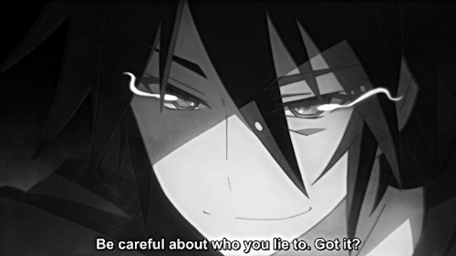

# Konichiwa 👋

 
 
 

# About ME 💬 :

### - I'm 19 years old Computer Enthusiast from India.

### - Learning :

- ✨ Data Structures & Algorithms
- ✨ DevOps

### - Hobbies :

- ✨ Chess Addict
- ✨ Watching Anime
- ✨ Gym

 
 
 

# Languages & Tools 👨‍💻 🛠:

 

<!-- For more icons please follow  https://github.com/MikeCodesDotNET/ColoredBadges -->

 
 
 

# Contact Me :

  

If you want to reach out to me about anything, be it some doubt or just to hangout and talk or want to game together just ping me 😉.

<a href="https://www.linkedin.com/in/mohit-dudhat-8b93bb29b">
  
 
 
 
</a>

 

 
 
 
 
 
 
 
<!-- <h1 align="center">Hi 👋, I'm Bap</h1>
<h3 align="center">I'm the Lead DevRel@Quine, a deep tech start up helping developers monetise their reputation!</h3> ** -->
<!-- 

- 📊 I worked in Analytics at TikTok, Glovo and Uber for the past couple of years.

- 📝 I regularly write articles on [dev.to](https://dev.to/fernandezbaptiste)

- 💬 Ask me about **DevRel, Data Analysis and content creation,**

- 🔭 I’m currently working on [building a simple repo for everyone to learn how to contribute](https://github.com/quine-sh/Your-First-Contribution)

- 🤝 I’m looking for help with **in building cool developer communities**

- 🌱 I’m trying to learn **Solidity**

- ⚡ Fun fact \*\*I can speak Mandarin :

 -->

  
  

	<picture>
	  <source media="(prefers-color-scheme: dark)"  srcset="https://raw.githubusercontent.com/mohitdudhat22/mohitdudhat22/output-3d-contrib/night.svg" />
	  <source media="(prefers-color-scheme: light)" srcset="https://raw.githubusercontent.com/mohitdudhat22/mohitdudhat22/output-3d-contrib/day.svg" />
	  
	</picture>

  

---
