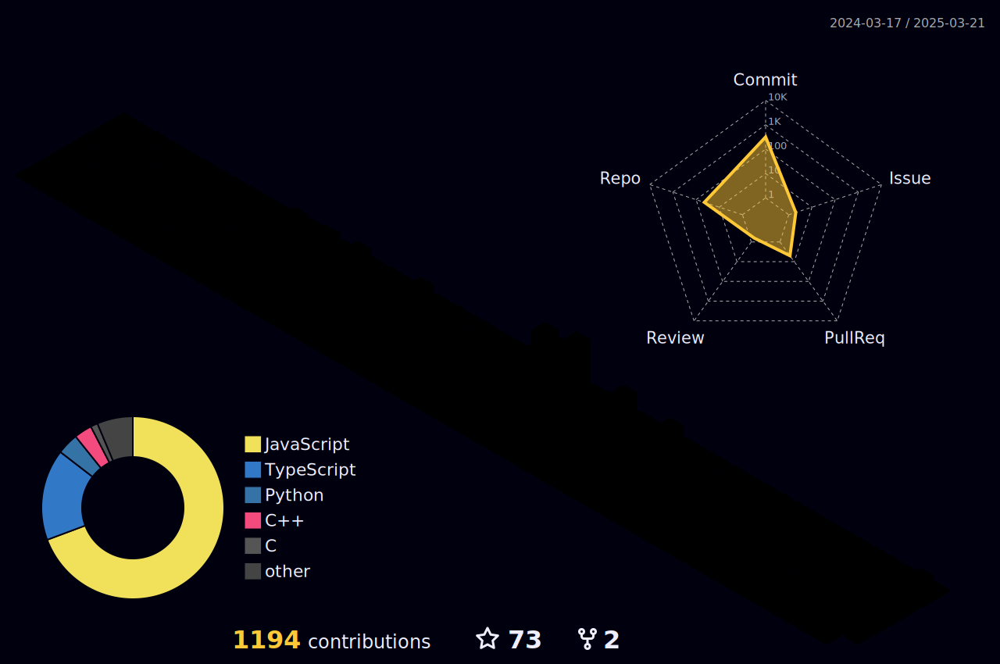

<!-- part-1  -->
# Konichiwa 👋

 

 

<!-- part-1  -->

<!-- part 2 -->
# About ME 💬 :

### - I'm 20 years old Computer Enthusiast from India.

### - Learning :

- ✨ Data Structures & Algorithms
- ✨ DevOps

### - Hobbies :

- ✨ Chess Addict
- ✨ Watching Anime
- ✨ Gym

 
 
 

<!-- part 2 -->

<!-- part 3 -->
<!-- linux,docker,kubernetes,azure,netlify -->
<!-- git,vscode,github,vim,githubaction -->
# Technologies
<table>
<tr>
	<td><strong>Web Development</strong></td>
	<td><strong>Languages</strong></td>
</tr>
<tr>
		<td></td>
		<td></td>
</tr>
<tr>
	<td><strong>Cybersecurity&Cloud</strong></td>
	<td><strong>Tools</strong></td>
</tr>
<tr>
	<td></td>
	<td></td>
</tr>
</table>

<!-- part 3 -->

<!-- part 4 -->
# Github Stats

    

    
    
	

<!-- part 4 -->

# Leetcode Stats

	

<!-- part 5 -->
# Contact Me :

  

<!-- part 5 -->
---

